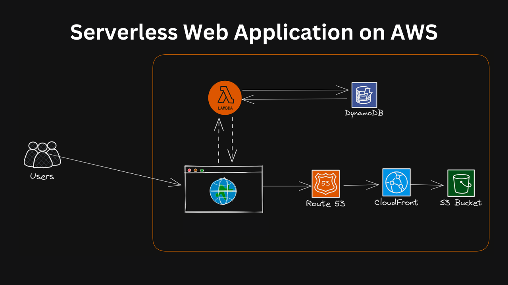

# AWS Serverless Web Application 

Project Description:
In this project, you will build a serverless web application using AWS Lambda, DynamoDB, and S3. The application will allow users to create, read, update, and delete (CRUD) items from a DynamoDB table.


Project Architecture:

-   

# Steps to Build the Project:
-   Create a DynamoDB table to store the items. \
-   Build a Lambda function to handle the CRUD operations on the DynamoDB table. \
-   Use S3 to store and host the web application's static files (HTML, CSS, and JavaScript). \
-   Create a CloudFront distribution to serve the S3-hosted static files with low latency. \


-   Step 1: create S3 Bucket
    -   S3
        -   Create bucket
            -   Bucket name => aws-serverless-web-application
            -   create bucket
    -   upload web application

-   Step 2: Setup CloudFront
    -   CloudFront
        -   Create CloudFront
            -   origin domain => select S3 bucket
            -   origin access control setting
            -   Select origin access control
        -   create
        -   click cloudfront distrbution you create
            -   select origins
                -   select serverless web application and edit
                    -   copy policy
                # allow cloudeFront access S3 bucket
                # go to S3 and select bucket and permission and select bucket policy and past in it code

-   Step 3: enable Route 53 to add alternaate domain name to website 
    -   Route 53
        -   Registered domain
            -   create hosted zone
                -   name => mostapha.me
            -   created hosts zone
            -   copy route traffic and go to your domain and mangae it and manage dns and edit nameservers and past in nameserver
    -   go to cloudfront and edit alternative domain name => add item =>mostapha.me
    -   go to route 53 to add record => 
        -   create record
            -   name
            -   alias => select cloudFront
        -   save
# for Views
-   Step 4: Create dynamoDB table 
    -   DynamoDB
        -   create table
            -   name => serverless web application
        -   partation key => id
        -create table
    -   explore table
        -   create item
            -   add new attribute
                -   name => Views => 1

-   create Iam role
    -   iam
        -   Roles
            -   click Lambda
                -create
                -   search dynamoDB and select DynamoDBFullAccess
    -   create role


-   Step 5: Create lambda function and integrate with dynamoDB table
    -   Lambda
        -   create Function
            -   Author from scrash
            -   name => serverless-web-application
            -   runtime => python 3.9
            -   Advanced => enabled function url - None
            -   Configure cross-origin resouces
        -   copy function url
    -   write code 

    ```bash
    import json
import boto3
dynamodb = boto3.resource('dynamodb')
table = dynamodb.Table('serverless-web-application-on-aws')
def lambda_handler(event, context):
    response = table.get_item(Key={
        'id':'0'
    })
    views = response['Item']['views']
    views = views + 1
    
    print(views)
    
    response = table.put_item(Item={
        'id':'0',
        'views': views
    })
    
    return views
    ```
    -   go to configuration and permision edit and assign role lambdafun
    -   And deploy

    
-   Step 6: Intergrate Lambda function with website

-   copy lamda url and past in code  java script in the S3 bucket